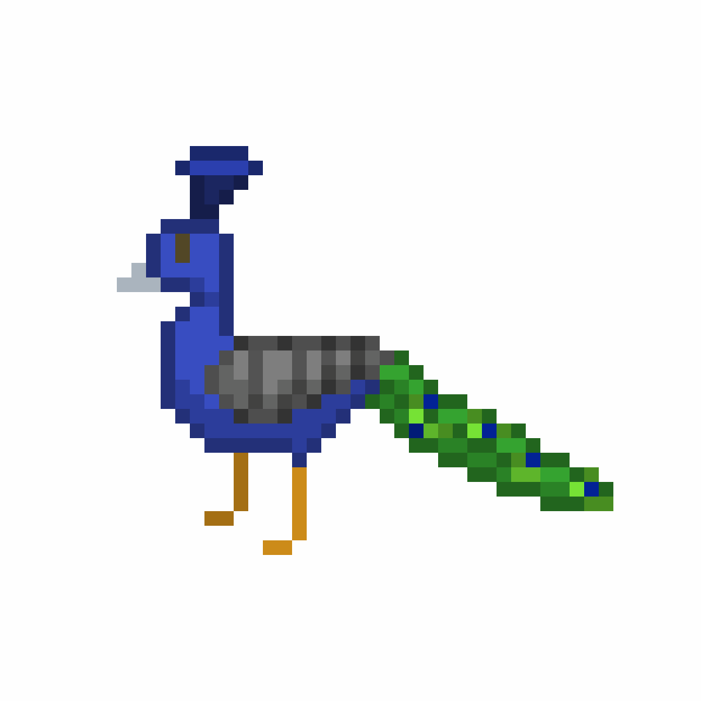

<a name="readme-top"></a>

<br />
<div align="center">
  <a href="https://github.com/nonra/find-the-peacock">
    
  </a>

  <h3 align="center">Find the peacock!</h3>

  <p align="center">
    Entrega final do curso "Construção de Algoritmos e Programação"
</div>

## Introdução

O conceito do jogo, personagens e nomes vieram de ideias completamente aleatórias.


### Requisitos

-   [![Raylib][raylib-logo]][raylib-url]
-   [![GCC][gcc-logo]][gcc-url]

### Como rodar

1. Clone the repositório
    ```sh
    git clone https://github.com/nonra/find-the-peacock.git
    ```
2. Acesse a pasta clonada

    ```sh
    cd ./find-the-peacock
    ```

3. Compile

    ```sh
    gcc  -I. src/main.c -o app -lraylib -lGL -lm -lpthread -ldl -lrt -lX11
    ```

4. Execute o executável gerado
    ```sh
    ./app
    ```

### Roadmap

-   [ ] Base de dados (txt)
-   [ ] Interface + Animações
-   [ ] Lógica do jogo

<p align="right">(<a href="#readme-top">Voltar para o topo</a>)</p>

[raylib-url]: https://www.raylib.com/index.html
[raylib-logo]: https://img.shields.io/badge/raylib-000000?style=for-the-badge&logo=raylib&logoColor=white
[gcc-url]: https://gcc.gnu.org/
[gcc-logo]: https://img.shields.io/badge/gcc-000000?style=for-the-badge&logo=raylib&logoColor=white
[demo]: assets/images/demo.gif
